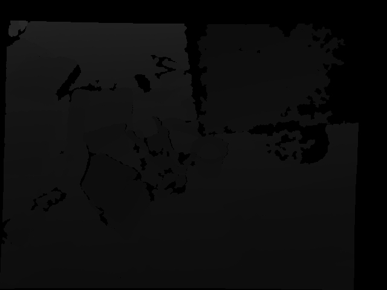
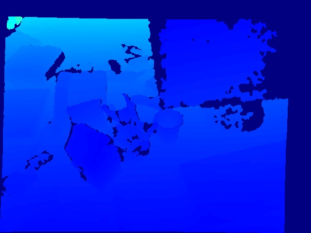
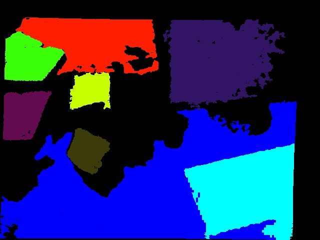

# plane-extraction
the plane extraction based on c++

 

Conversion of depth to point cloud through camera calibration information

camera calibration:

fx 0 cx

0 fy cy

0 0 1

formualtion 

X = (x - cx) / fx * depth

Y = (y - cy) / fy * depth 

Z = depth

